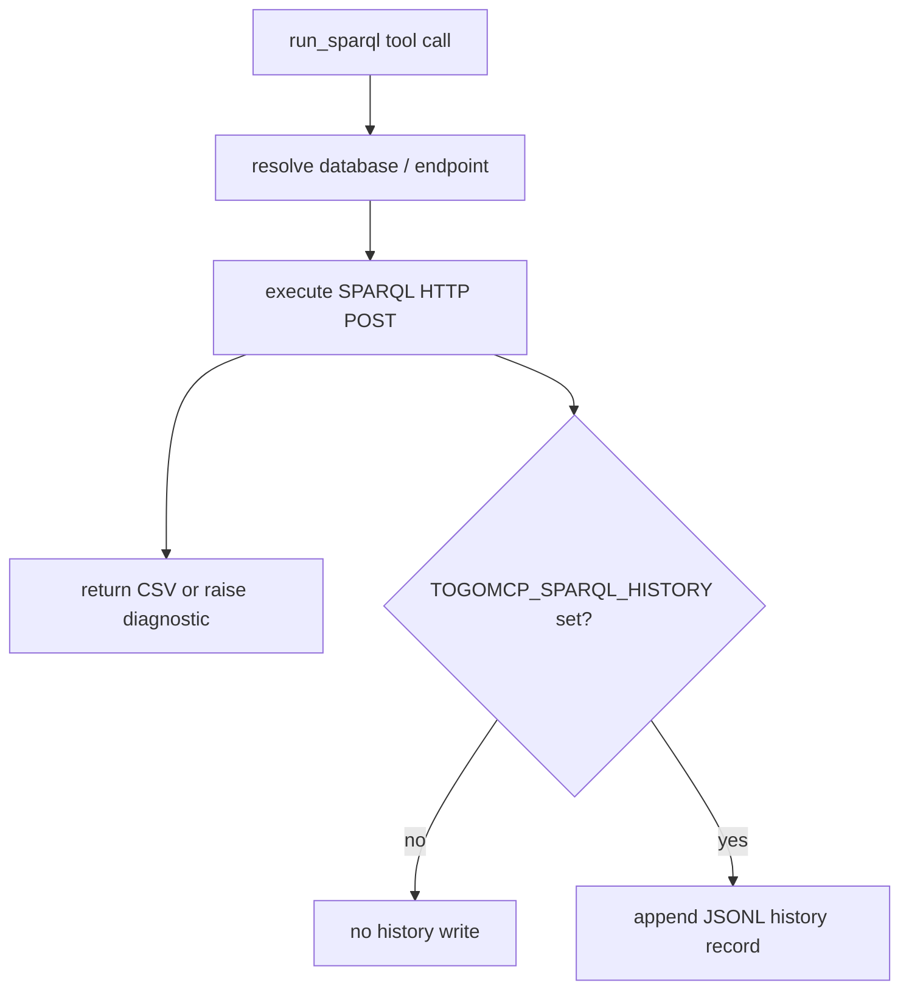

# SPARQL History Logging Design

## Purpose

Add a SPARQL-specific execution history log to improve reproducibility and debugging. TogoMCP already supports `TOGOMCP_QUERY_LOG`, which records general MCP tool calls. This feature adds a narrower history stream for `run_sparql` executions so users can recover the exact query, resolved endpoint, outcome, and compact result metadata without digging through all tool calls.

## Goals

- Preserve the exact SPARQL text used for each `run_sparql` execution.
- Record enough endpoint information to reproduce the request later.
- Capture success and failure metadata useful for debugging.
- Keep normal `run_sparql` behavior and return values unchanged.
- Make the feature opt-in with zero overhead when disabled.
- Avoid storing full query results by default to prevent large logs and reduce sensitive-data risk.

## Non-goals

- Do not add MCP tools for browsing, searching, or rerunning history in the first implementation.
- Do not store full SPARQL result bodies.
- Do not replace `TOGOMCP_QUERY_LOG`; the new history log complements it.

## User-facing behavior

A new environment variable enables the history file:

```bash
TOGOMCP_SPARQL_HISTORY=/path/to/sparql-history.jsonl
```

When unset or empty, no SPARQL history file is created. When set, every `run_sparql` execution appends one JSON object per line. The JSONL file is intended for command-line inspection, post-processing, benchmark analysis, and future MCP history tools.

## History record schema

Each line should contain a JSON object with these fields where available:

- `ts`: UTC ISO-8601 timestamp.
- `database`: original `database` argument after alias resolution.
- `endpoint_name`: original `endpoint_name` argument.
- `endpoint_url`: resolved endpoint URL used for the HTTP request.
- `sparql_query`: exact SPARQL query string submitted.
- `query_sha256`: SHA-256 hash of the stripped query text.
- `status`: `ok`, `timeout`, `network_error`, `http_4xx`, `http_5xx`, or `error`.
- `elapsed_ms`: elapsed time for endpoint resolution and HTTP execution.
- `http_code`: HTTP status code when an HTTP response exists.
- `n_rows`: approximate number of result rows for successful CSV responses.
- `n_bytes`: response byte count when an HTTP response exists.
- `result_sha256`: SHA-256 hash of the response body for successful responses.
- `error_class`: exception class name for failures.
- `error_message`: truncated diagnostic message for failures.

The schema should be additive: future versions may append fields, but should not remove or rename these fields casually.

## Architecture

Implement the history writer in `togo_mcp/server.py`, near the existing SPARQL execution and tool-call logging code.

Recommended structure:

1. Add a small helper class or function that lazily initializes a `RotatingFileHandler` from `TOGOMCP_SPARQL_HISTORY`.
2. Update `execute_sparql()` to collect SPARQL-specific metadata around endpoint resolution and the HTTP call.
3. In a `finally` block, append a JSONL record only when history logging is enabled.
4. Keep logging failure-safe: inability to write the history file must not break the user’s SPARQL call.

The existing `_ToolCallLogger` should remain unchanged except for any shared helper extraction that clearly reduces duplication. The new history path should be separate from `TOGOMCP_QUERY_LOG` so operators can enable either log independently.

## Data flow



## Error handling

- Endpoint resolution errors should be recorded when possible with `status: "error"` and no `endpoint_url` if resolution failed.
- HTTP timeout should record `status: "timeout"`.
- Network errors should record `status: "network_error"`.
- 4xx and 5xx responses should record `http_4xx` or `http_5xx` plus response byte count and truncated error diagnostic.
- History logging errors should be swallowed after best-effort internal logger warning, because observability must not break query execution.

## Documentation updates

Update `README.md` near the existing Tool-Call Logging section:

- Explain the difference between `TOGOMCP_QUERY_LOG` and `TOGOMCP_SPARQL_HISTORY`.
- Show local stdio and Docker examples.
- State that full result bodies are not stored; only hashes and compact metadata are recorded.

Update `.env.example` if it already documents logging-related environment variables.

## Testing strategy

Add focused tests in `tests/test_server.py`:

1. Disabled history logging does not write a file.
2. Successful SPARQL execution writes one JSONL record with query text, resolved endpoint URL, status, row/byte counts, and result hash.
3. HTTP error writes one JSONL record with failure status and diagnostic metadata.
4. Timeout or network error paths record failure status without masking the original exception.
5. History logging write failures do not fail the SPARQL call.

Use `respx` or monkeypatching around `_sparql_client.post` to avoid real network calls.

## Future extensions

This design intentionally leaves room for future MCP tools such as:

- `list_sparql_history`
- `get_sparql_history_entry`
- `rerun_sparql_history_entry`

Those tools should be added only after the JSONL format is stable and the project has clear requirements for privacy, pagination, and safe reruns.
